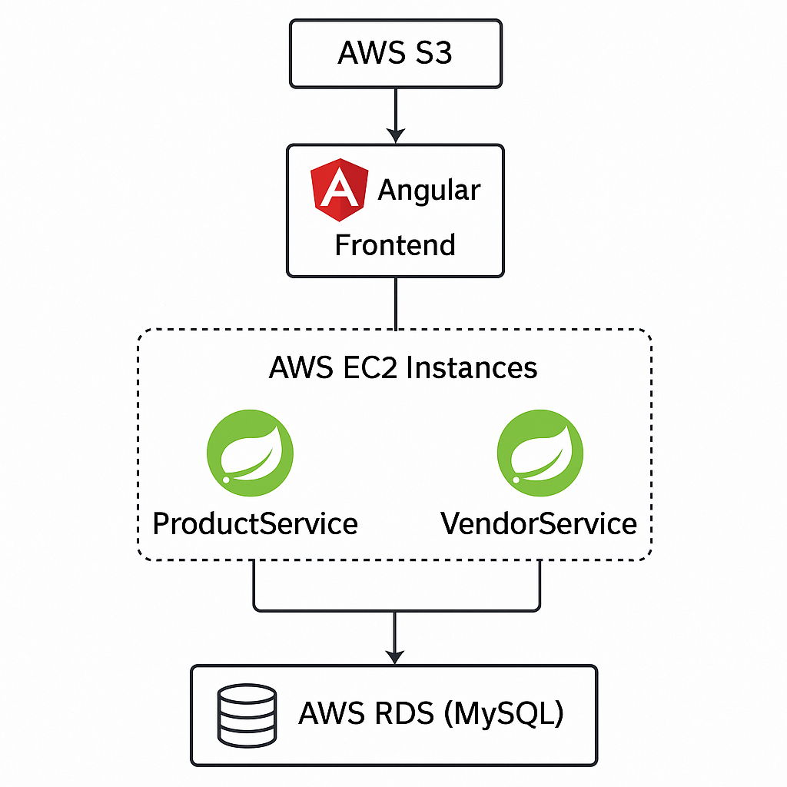

# 🛍️ GadgetHive

**GadgetHive** is a microservice-based full-stack web application for browsing and selling laptops. It enables two user groups:
- 🧑‍💻 **Vendors** to register and list laptops for sale.
- 🛒 **Buyers** to browse available products and view details.

Built with **Angular 12**, **Spring Boot**, **MySQL**, and deployed using **AWS Cloud Infrastructure**.

## 🔗 Useful Links

| Service           | Repository URL                                     |
|------------------|-----------------------------------------------------|
| Frontend          | [GadgetHive-Frontend](https://github.com/sanjay872/GadgetHive-Frontend) |
| ProductService    | [ProductService](https://github.com/sanjay872/ProductService) |
| VendorService     | [VendorService](https://github.com/sanjay872/VendorService) |


## 🧩 System Architecture
 

## 🔧 Tech Stack

| Layer       | Tech                              |
|------------|------------------------------------|
| Frontend    | Angular 12, HTML, CSS             |
| Backend     | Spring Boot (Java)                |
| Auth        | JWT (Vendor login)                |
| Database    | MySQL on AWS RDS                  |
| DevOps      | Jenkins CI/CD, AWS EC2, AWS S3    |
| Hosting     | S3 for frontend, EC2 for backend  |


## 📂 Project Structure

| Folder/Repo                | Description                                 |
|---------------------------|---------------------------------------------|
| `GadgetHive-Frontend`     | Angular frontend hosted on AWS S3           |
| `ProductService`          | Spring Boot microservice for products       |
| `VendorService`           | Spring Boot microservice for vendors/auth   |


## 🚀 Deployment Overview

### ✅ Frontend (Angular)
- Built using `ng build --prod`
- Hosted on **AWS S3** with static website hosting enabled
- Configured environment URLs for backend API endpoints

### ✅ Backend Microservices
- Split into **ProductService** and **VendorService**
- Built using Spring Boot and Maven
- Deployed via:
  - **Jenkins** CI/CD pipelines (local)
  - **AWS EC2** instances for hosting the services
  - **AWS RDS** (MySQL) for shared relational database

## 🛠 Local Development

### Frontend
```bash
cd GadgetHive-Frontend
npm install
ng serve
```

### ProductService
```bash
cd ProductService
./mvnw spring-boot:run
```

### VendorService
```bash
cd ProductService
./mvnw spring-boot:run
```

Update application.properties with your local or RDS MySQL credentials.

## 📈 Future Improvements
- Add Buyer login and order history

- Implement product search and filters

- Add unit and integration tests

- Dockerize services and use AWS ECS

## 🙌 Acknowledgments
- This project was developed and deployed as a hands-on learning experience in:
- Full-stack microservices architecture
- AWS-based deployment
- CI/CD pipeline automation with Jenkins
